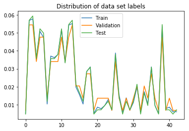
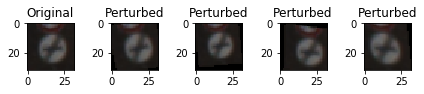
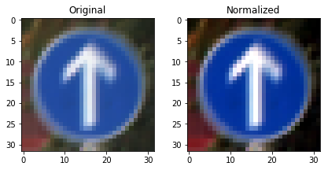
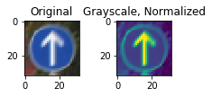
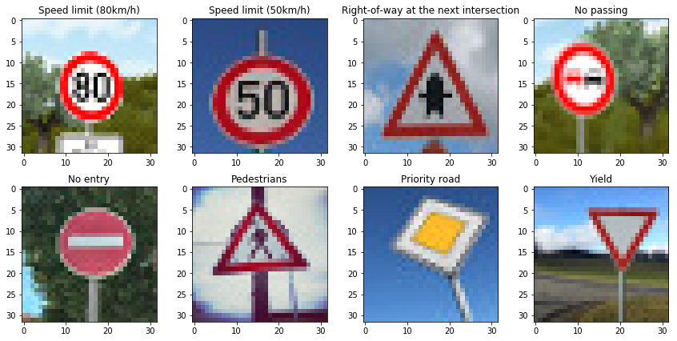
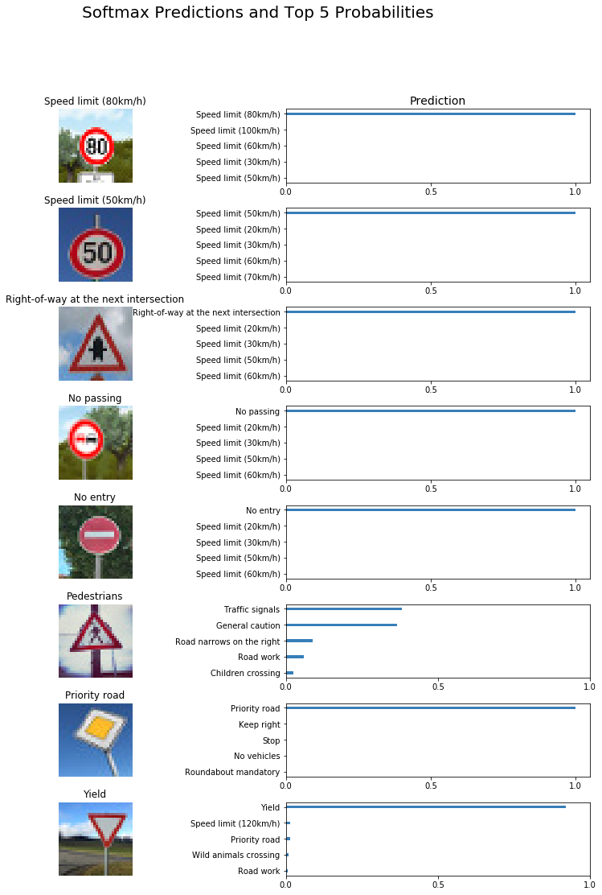

## Project: Traffic Sign Recognition

This project uses convolutional neural networks to classify traffic signs from the German Traffic Sign Dataset.

## Data Set Summary & Exploration

I used Numpy to calculate summary statistics of the traffic signs data set:

* The size of training set is 34,799
* The size of the validation set is 4410
* The size of test set is 12,630
* The shape of a traffic sign image is (32,32,3)
* The number of unique classes/labels in the data set is 43

Here is an exploratory visualization of the data set. The graph shows distribution of labels for each data set: training, validation, and test

Samples are distributed largely evenly across all three data sets, except for labels in the 19-24 range (Dangerous Curve Left & Right, Double Curve, Bumpy Road Slippery Road, Road Narrows on Right) where the validation set has more samples that training and test sets.

## Design and Test a Model Architecture
### Image Pre-Processing
My first step was to increase the training data 5 folds by perturbing the images in the training dataset using the skimage library. Each image was 4 times randomly:
* rotated between -10 and 10 degrees
* translated between -3 and 3 pixels in all directions
* zoomed between 0.9 and 1.2
* sheared between -15 and 15 degrees

Example of original and perturbed images:

Perturbed images were added to the training data set, after which the combined data set was shuffled.

Every image in the training data set was normalized to ensure uniform contrast. This was done using the Pillow library.

Example of original and normalized images:

I then converted the images to grayscale. Example of original and normalized grayscale images:

### Model architecture
Final model consisted of the following layers:

| Layer         		|     Description	        					|
|:---------------------:|:---------------------------------------------:|
|Input         		| 32x32x3 RGB image   							|
|Convolution 5x5 | 1x1 stride, valid padding, outputs 28x28x8 |
|Convolution 5x5 | 1x1 stride, valid padding, outputs 24x24x32 |
|Max pooling | 2x2 stride, outputs 12x12x32 |
|Convolution 5x5 | 1x1 stride, valid padding, outputs 8x8x64 |
|Max pooling| 2x2 stride, outputs 4x4x64 |
|Fully connected | input 1024, output 512 |
|Dropout | 0.5 keep probability |
|Fully connected | input 512, output 256 |
|Dropout | 0.5 keep probability |
|Fully connected | input 256, output 84 |
|Dropout | 0.5 keep probability |
|Fully connected | input 84, output 43 |
|Softmax | one hot vector size 43|

To train the model I used the AdamOptimizer with a batch size of 256, 1000 epochs, and 0.0003 starting learning rate.

My final model results were:
* training set accuracy:0.99
* test set accuracy:0.966

I started with the default configuration of 2 conv layers and 2 fully connected layers and without fake images, which resulted in the accuracy of 0.89. In order to reduce overfitting I added dropouts, which increased accuracy to 0.92. Adding an extra connected layer and max pooling increased learning capability and further reduced overfitting, leading to the accuracy of 0.95. Adding local response normalization did not make any difference and so I removed this feature. Next I increased the model to 3 conv layers and 3 fully connected layers, which increased accuracy to 0.97. Adding 4 conv layers and 3 fully connected layers did not make any difference. With each change, I trained the model with different batch sizes (256, 512) trying epochs between 500 to 2000 as needed.

I also ran the model on full color images. This decreased validation accuracy to 0.973 resulting in test data accuracy to 0.94 and image from the web accuracy of 0.75.

I tried adding more fake images (11x), however it did not increase training or validation accuracy (0.96 and 0.94), but surprisingly did better at identifying web images (0.875). Since it is not recommended to optimize around the test data set due to overfitting, I reverted back to the smaller fake image set (5x).

Increasing the batch size did not improve accuracy and the model took longer to converge.

The resulted model performed well on the test data resulting in the accuracy of 0.966

## Testing the Model on New Images
Here are eight German traffic signs that I found on the web:

The model was able to predict 7 out 8 signs, which gives an accuracy of 0.875. The only sign the model struggled with is Pedestrians. Pedestrians is a triangular sign with a picture of a person inside. The model confused the sign with similar looking triangular signs with pictures, such as Traffic Signals and General Caution. Higher resolution of images would likely prevent this problem.

Below are the results of the predictions and weights given top five probabilities:

